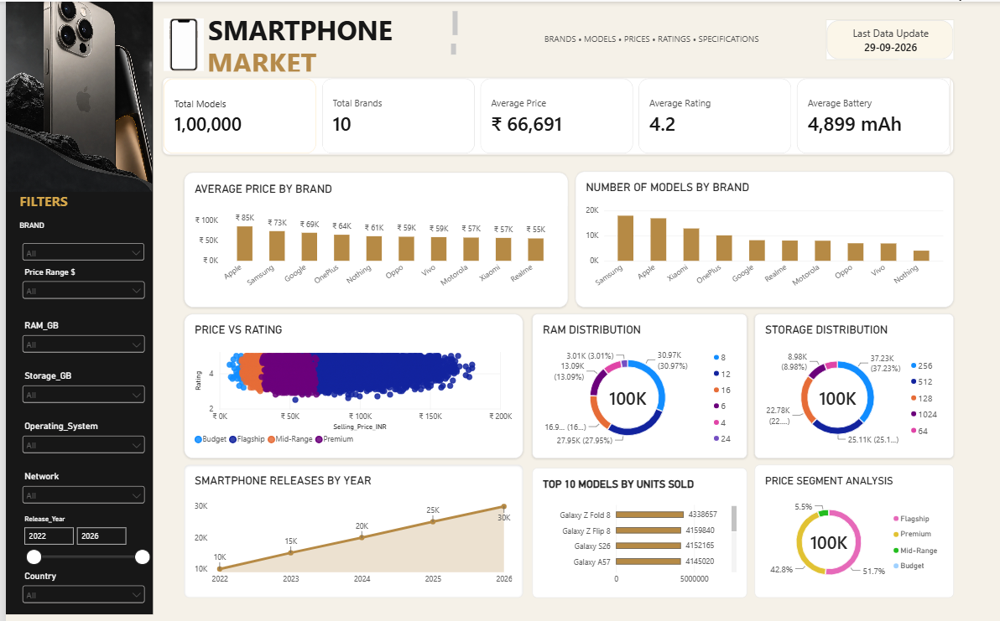

# 📱 Smartphone Market Analytics Dashboard

An interactive **Power BI dashboard** for analyzing the smartphone market across brands, models, pricing, ratings, specifications, releases, and sales performance.

## 🎯 Project Objective

The objective of this project is to transform smartphone market data into an interactive business intelligence dashboard that helps analyze:

- Smartphone brands and models
- Average smartphone prices
- Customer ratings
- Battery capacity
- RAM and storage distribution
- Smartphone releases over time
- Price segments
- Top-selling smartphone models

## 🛠️ Tools & Technologies

- Power BI
- Power Query
- DAX
- Data Cleaning
- Data Modeling
- Data Visualization
- Business Intelligence

## 📊 Dashboard Overview

### Key Metrics

The dashboard provides the following high-level metrics:

- **Total Models:** 100,000
- **Total Brands:** 10
- **Average Price:** ₹66,691
- **Average Rating:** 4.2
- **Average Battery:** 4,899 mAh

### 📈 Market Analysis

The dashboard includes visual analysis for:

- Average Price by Brand
- Number of Models by Brand
- Price vs Rating
- RAM Distribution
- Storage Distribution
- Smartphone Releases by Year
- Top 10 Models by Units Sold
- Price Segment Analysis

### 🔎 Interactive Filters

Users can interact with the dashboard using filters for:

- Brand
- Price Range
- RAM
- Storage
- Operating System
- Network
- Release Year
- Country

## 📌 Key Insights

The dashboard enables analysis of:

- Brand-level pricing differences
- Distribution of smartphone models across brands
- Relationship between smartphone price and rating
- RAM and storage preferences
- Smartphone release trends from 2022–2026
- Top-performing smartphone models by units sold
- Distribution across Budget, Mid-Range, Premium and Flagship segments

## 🖼️ Dashboard Preview

  

## 📁 Project Files

| File | Description |
|---|---|
| `Mobile.pbix` | Power BI dashboard |
| `dashboard-preview.png` | Dashboard preview |

## 💡 Skills Demonstrated

`Power BI` `Power Query` `DAX` `Data Cleaning` `Data Modeling` `Data Visualization` `Business Intelligence` `Data Analytics`

## 👨‍💻 Author

**Ajay Dev**

Data Analyst | Data Scientist

[GitHub](https://github.com/AjayDev007-lab)
